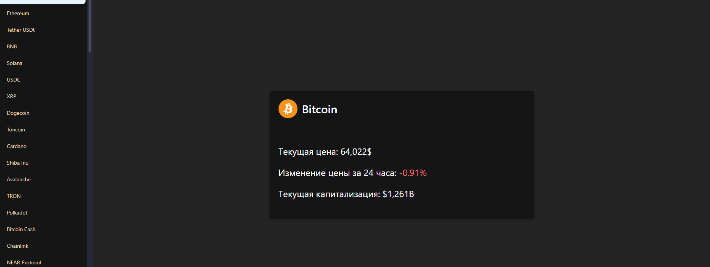

#  Tracker of crypto price 

## Using Technologuies 
- FastAPI + pydantic, pydantic-settings, aiohttp
- React + axios, ant design, tailwind

### How to start 
#### Backend
- `python3 -m venv venv`
- `. venv/bin/activate` or `.\venv\Scripts\activate.bat`
- `pip install -r requirements.txt`
- `uvicorn src.main:app --reload` (be inside the backend folder)

#### Frontend
- `npm create vite@latest`
- `npm install`
- `npm run dev`
